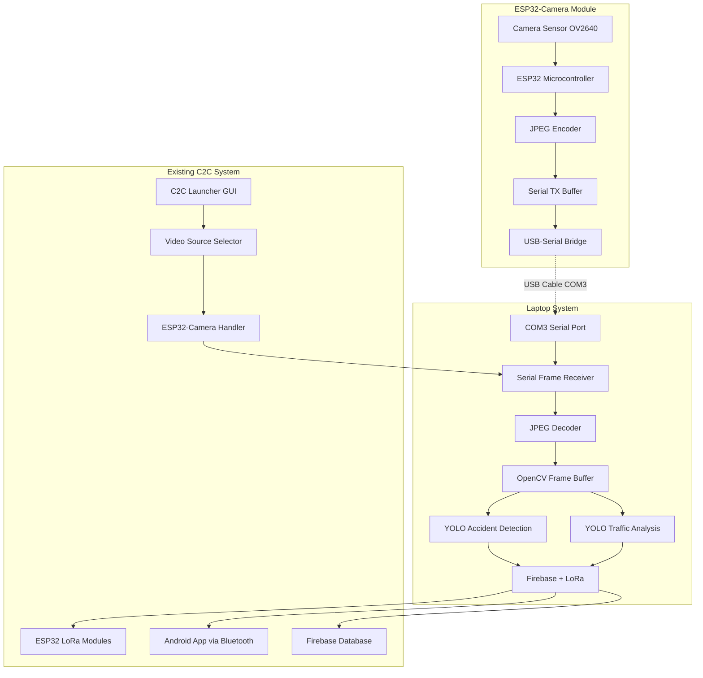

# Design Document: ESP32-Camera Integration

## Overview

This design integrates ESP32-camera module as a video source for the existing V2V communication system. The ESP32-camera will connect to the laptop via USB cable on COM3 port and stream JPEG-compressed video frames over serial communication. The system will seamlessly integrate with the existing YOLO-based accident detection and traffic analysis pipeline.

## Architecture



## Components and Interfaces

### 1. ESP32-Camera Firmware

**Purpose**: Capture video frames and transmit them over serial communication

**Key Components**:
- Camera initialization and configuration
- JPEG compression engine
- Serial frame transmission protocol
- Command processing for configuration changes

**Interface Specifications**:
```cpp
// Serial Protocol Commands (Laptop -> ESP32)
CONFIG|resolution:VGA|fps:15|quality:50
CAPTURE|mode:continuous
STOP|

// Serial Protocol Responses (ESP32 -> Laptop)  
FRAME_START|size:12345|seq:001
<JPEG_DATA_CHUNKS>
FRAME_END|seq:001|checksum:ABCD
STATUS|fps:14.2|temp:45.6|free_heap:234567
```

### 2. Serial Communication Protocol

**Frame Transmission Format**:
```
FRAME_START|size:<bytes>|seq:<sequence_number>
<JPEG_DATA_BINARY>
FRAME_END|seq:<sequence_number>|checksum:<CRC32>
```

**Protocol Features**:
- Frame size pre-announcement for buffer allocation
- Sequence numbers for frame ordering and loss detection
- CRC32 checksum for data integrity verification
- Configurable chunk size (default 1024 bytes)
- Automatic retry mechanism for corrupted frames

### 3. Laptop Video Receiver

**Purpose**: Receive serial frames and convert to OpenCV format

**Key Components**:
```python
class ESP32CameraReceiver:
    def __init__(self, port="COM3", baud=921600):
        self.serial_port = serial.Serial(port, baud, timeout=0.1)
        self.frame_buffer = bytearray()
        self.current_frame_size = 0
        self.sequence_number = 0
        
    def read_frame(self) -> Optional[np.ndarray]:
        # Read frame header, data chunks, and footer
        # Validate checksum and sequence
        # Decode JPEG to OpenCV format
        pass
        
    def configure_camera(self, resolution, fps, quality):
        # Send configuration commands to ESP32
        pass
```

### 4. Integration with C2C Launcher

**Modified Video Source Selection**:
```python
# Enhanced video source options in c2c_launcher.py
VIDEO_SOURCES = {
    "webcam_0": "0",
    "webcam_1": "1", 
    "esp32_camera": "ESP32_CAM:COM3",
    "video_file": "Browse..."
}

def open_capture(src_str: str):
    if src_str.startswith("ESP32_CAM:"):
        port = src_str.split(":")[1]
        return ESP32CameraCapture(port), True
    # ... existing logic
```

## Data Models

### Camera Configuration
```python
@dataclass
class CameraConfig:
    resolution: str = "VGA"  # QVGA, VGA, SVGA, XGA
    fps: int = 15           # 5-30 FPS
    quality: int = 50       # JPEG quality 10-63
    port: str = "COM3"      # Serial port
    baud: int = 921600      # Baud rate
    
    def to_command(self) -> str:
        return f"CONFIG|resolution:{self.resolution}|fps:{self.fps}|quality:{self.quality}"
```

### Frame Metadata
```python
@dataclass
class FrameMetadata:
    sequence: int
    size: int
    timestamp: float
    checksum: str
    fps: float
    
    @classmethod
    def from_header(cls, header: str) -> 'FrameMetadata':
        # Parse FRAME_START header
        pass
```

## Correctness Properties

*A property is a characteristic or behavior that should hold true across all valid executions of a system-essentially, a formal statement about what the system should do. Properties serve as the bridge between human-readable specifications and machine-verifiable correctness guarantees.*

Based on the prework analysis, here are the key correctness properties for ESP32-camera integration:

### Property 1: Camera Initialization Consistency
*For any* ESP32-camera device, when initialization commands are sent, the camera should respond with expected status messages indicating successful configuration.
**Validates: Requirements 1.2**

### Property 2: Frame Rate Performance
*For any* operating condition, the ESP32-camera should maintain a frame capture rate of at least 15 FPS during continuous operation.
**Validates: Requirements 1.4**

### Property 3: JPEG Format Compliance
*For any* captured frame, the transmitted data should have valid JPEG headers and structure that can be decoded by standard JPEG decoders.
**Validates: Requirements 1.5**

### Property 4: Frame Protocol Compliance
*For any* transmitted video frame, the data should be wrapped with proper frame delimiters (FRAME_START and FRAME_END markers).
**Validates: Requirements 2.1, 2.2, 2.4**

### Property 5: Frame Chunking Consistency
*For any* frame larger than the chunk size, the transmission should split the data into appropriately sized chunks with proper sequencing.
**Validates: Requirements 2.3**

### Property 6: Error Recovery Behavior
*For any* transmission error or frame corruption, the system should detect the error and initiate appropriate retry or recovery mechanisms.
**Validates: Requirements 2.5, 6.2**

### Property 7: Frame Reconstruction Integrity
*For any* received frame chunks, the system should correctly reassemble them into complete JPEG frames that match the original data.
**Validates: Requirements 3.2**

### Property 8: Frame Decoding Success
*For any* complete JPEG frame received, the system should successfully decode it to OpenCV format with expected dimensions and properties.
**Validates: Requirements 3.3**

### Property 9: Frame Validation Consistency
*For any* decoded frame, the system should perform integrity validation and reject frames that fail validation checks.
**Validates: Requirements 3.4**

### Property 10: Buffer Management Efficiency
*For any* timing variation in frame arrival, the frame buffer should handle the variations without data loss or corruption.
**Validates: Requirements 3.5**

### Property 11: YOLO Integration Compatibility
*For any* ESP32-camera frame, the existing YOLO accident detection and traffic analysis systems should process the frames without modification.
**Validates: Requirements 4.3, 4.4**

### Property 12: System Integration Preservation
*For any* ESP32-camera operation, all existing Firebase and LoRa communication features should continue to function normally.
**Validates: Requirements 4.5**

### Property 13: Configuration Range Validation
*For any* camera configuration parameter (frame rate 5-30 FPS, JPEG quality 10-63), values within the specified ranges should be accepted and applied.
**Validates: Requirements 5.2, 5.3**

### Property 14: Configuration Command Propagation
*For any* configuration change in the UI, appropriate configuration commands should be sent to the ESP32-camera device.
**Validates: Requirements 5.4**

### Property 15: Configuration Persistence
*For any* saved camera configuration, the settings should be restored correctly when the system restarts.
**Validates: Requirements 5.5**

### Property 16: Connection Recovery Automation
*For any* connection failure, the system should automatically attempt reconnection according to the configured retry policy.
**Validates: Requirements 6.1, 6.4**

### Property 17: Fallback Mechanism Reliability
*For any* ESP32-camera disconnection, the system should automatically fallback to the default webcam without user intervention.
**Validates: Requirements 6.3**

### Property 18: Error Logging Completeness
*For any* connection or transmission error, the system should log the error with appropriate details for debugging.
**Validates: Requirements 6.5**

### Property 19: Performance Maintenance
*For any* normal operating condition, the system should maintain at least 10 FPS for YOLO inference processing.
**Validates: Requirements 7.1**

### Property 20: Buffer Overflow Management
*For any* buffer overflow condition, the system should drop the oldest frames to prevent processing lag.
**Validates: Requirements 7.2**

### Property 21: Adaptive Performance Control
*For any* high CPU usage condition, the system should automatically reduce frame rate to maintain system stability.
**Validates: Requirements 7.3**

### Property 22: Performance Monitoring Accuracy
*For any* video processing operation, the system should accurately collect and display performance metrics.
**Validates: Requirements 7.4**

### Property 23: Memory Usage Optimization
*For any* continuous operation period, the system should maintain stable memory usage without memory leaks.
**Validates: Requirements 7.5**

### Property 24: UI Status Synchronization
*For any* ESP32-camera selection or status change, the UI should display accurate connection status and camera information.
**Validates: Requirements 8.2**

### Property 25: Video Preview Functionality
*For any* active camera with display enabled, the system should show live video preview in the UI.
**Validates: Requirements 8.3**

### Property 26: UI Control Synchronization
*For any* camera setting change, the UI controls should update to reflect the current camera configuration.
**Validates: Requirements 8.4**

### Property 27: Status Indicator Accuracy
*For any* camera operation or error condition, the system should provide appropriate status indicators and error messages.
**Validates: Requirements 8.5**

<function_calls>
<invoke name="prework">
<parameter name="featureName">esp32-camera-integration

## Error Handling

### Serial Communication Errors
- **Connection Timeout**: Retry connection with exponential backoff (1s, 2s, 4s, max 30s)
- **Frame Corruption**: Request retransmission using sequence numbers
- **Buffer Overflow**: Drop oldest frames and log warning
- **Checksum Mismatch**: Discard frame and request retransmission

### Camera Hardware Errors
- **Initialization Failure**: Retry initialization up to 3 times, then fallback to webcam
- **Frame Capture Timeout**: Log error and continue with next frame
- **JPEG Encoding Error**: Skip corrupted frame and continue
- **Memory Allocation Failure**: Reduce frame buffer size and retry

### System Integration Errors
- **YOLO Processing Failure**: Log error but continue video stream
- **Firebase Upload Failure**: Queue data for retry when connection restored
- **LoRa Communication Failure**: Continue local processing, log communication errors

## Testing Strategy

### Unit Testing Approach
The testing strategy combines unit tests for specific functionality with property-based tests for comprehensive validation:

**Unit Tests Focus Areas**:
- Serial protocol parsing and frame reconstruction
- JPEG decoding and validation
- Configuration command generation
- Error handling and recovery mechanisms
- UI integration and status display

**Property-Based Testing Configuration**:
- **Testing Framework**: Use Python's `hypothesis` library for property-based testing
- **Test Iterations**: Minimum 100 iterations per property test
- **Test Data Generation**: Generate random frame sizes, configurations, and error conditions
- **Property Test Tagging**: Each test references its corresponding design property

**Example Property Test Structure**:
```python
from hypothesis import given, strategies as st
import pytest

@given(
    frame_size=st.integers(min_value=1024, max_value=65536),
    chunk_size=st.integers(min_value=256, max_value=2048)
)
def test_frame_chunking_consistency(frame_size, chunk_size):
    """
    Feature: esp32-camera-integration, Property 5: Frame Chunking Consistency
    For any frame larger than chunk size, transmission should split data appropriately
    """
    # Generate test frame data
    frame_data = generate_test_jpeg_frame(frame_size)
    
    # Chunk the frame
    chunks = chunk_frame_data(frame_data, chunk_size)
    
    # Verify chunking properties
    assert sum(len(chunk) for chunk in chunks) == frame_size
    assert all(len(chunk) <= chunk_size for chunk in chunks[:-1])
    assert len(chunks[-1]) <= chunk_size
    
    # Verify reconstruction
    reconstructed = reconstruct_frame_from_chunks(chunks)
    assert reconstructed == frame_data
```

**Integration Testing**:
- End-to-end video streaming from ESP32-camera to YOLO processing
- Configuration change propagation and persistence
- Error recovery and fallback mechanisms
- Performance under various load conditions

**Hardware-in-the-Loop Testing**:
- Actual ESP32-camera device connected to COM3
- Real-time frame transmission and processing
- Connection reliability under various conditions
- Performance validation with actual hardware constraints

### Test Coverage Requirements
- **Unit Test Coverage**: Minimum 90% code coverage for new components
- **Property Test Coverage**: All 27 correctness properties must have corresponding tests
- **Integration Test Coverage**: All major user workflows and error scenarios
- **Performance Test Coverage**: Frame rate, memory usage, and CPU utilization validation

The dual testing approach ensures both specific functionality works correctly (unit tests) and universal properties hold across all inputs (property tests), providing comprehensive validation of the ESP32-camera integration.