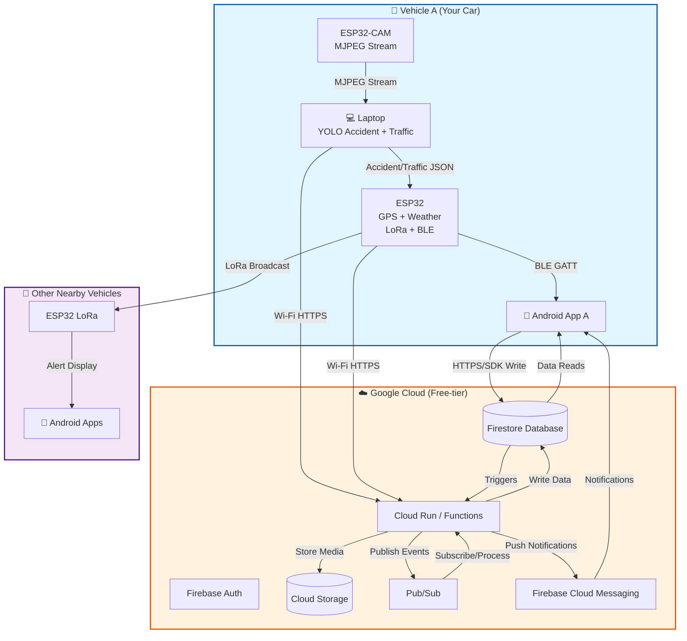

# Vehicle Accident Detection System Architecture

## Mermaid Flowchart (Corrected)



## Architecture Block Diagram

```
┌─────────────────────────────────────────────────────────────────────────────┐
│                         VEHICLE A (YOUR CAR)                                 │
├─────────────────────────────────────────────────────────────────────────────┤
│                                                                               │
│  ┌──────────────┐      ┌──────────────┐      ┌──────────────┐              │
│  │  ESP32-CAM   │      │    Laptop    │      │   ESP32      │              │
│  │              │      │              │      │              │              │
│  │  MJPEG       │─────▶│  YOLOv8      │─────▶│  GPS+Weather │              │
│  │  Stream      │      │  Accident    │      │  LoRa+BLE    │              │
│  │              │      │  Detection   │      │              │              │
│  └──────────────┘      │  Traffic     │      └──────┬───────┘              │
│                        │  Analysis    │             │                      │
│                        └──────┬───────┘             │                      │
│                               │                     │                      │
│                        ┌──────▼───────┐      ┌──────▼───────┐              │
│                        │   Wi-Fi      │      │     BLE      │              │
│                        │   HTTPS      │      │   (GATT)     │              │
│                        └──────┬───────┘      └──────┬───────┘              │
│                               │                     │                      │
│                        ┌──────▼─────────────────────▼───────┐              │
│                        │      Android App A                │              │
│                        │  (Display & Control)              │              │
│                        └───────────────────────────────────┘              │
│                                                                               │
└───────────────────────────────┬───────────────────────────────────────────────┘
                                │
                                │ LoRa Broadcast
                                │
┌───────────────────────────────▼───────────────────────────────────────────────┐
│                      OTHER NEARBY VEHICLES                                    │
├─────────────────────────────────────────────────────────────────────────────┤
│                                                                               │
│  ┌──────────────┐      ┌──────────────┐                                     │
│  │  ESP32 LoRa  │─────▶│ Android Apps │                                     │
│  │  (Receive)   │      │  (Alert)     │                                     │
│  └──────────────┘      └──────────────┘                                     │
│                                                                               │
└─────────────────────────────────────────────────────────────────────────────┘
                                │
                                │ HTTPS/SDK
                                │
┌───────────────────────────────▼───────────────────────────────────────────────┐
│                    GOOGLE CLOUD (Free-tier)                                   │
├─────────────────────────────────────────────────────────────────────────────┤
│                                                                               │
│  ┌──────────────┐      ┌──────────────┐      ┌──────────────┐              │
│  │   Firebase   │      │   Firestore  │      │    Cloud     │              │
│  │    Auth      │─────▶│  Database    │◀─────│   Storage    │              │
│  └──────────────┘      └──────┬───────┘      └──────────────┘              │
│                               │                                             │
│                        ┌──────▼───────┐      ┌──────────────┐              │
│                        │  Cloud Run   │─────▶│   Pub/Sub    │              │
│                        │  / Functions │      │              │              │
│                        └──────┬───────┘      └──────┬───────┘              │
│                               │                     │                      │
│                        ┌──────▼─────────────────────▼───────┐              │
│                        │  Firebase Cloud Messaging (FCM)   │              │
│                        │  (Push Notifications)              │              │
│                        └───────────────────────────────────┘              │
│                                                                               │
└───────────────────────────────┬───────────────────────────────────────────────┘
                                │
                                │ Notifications & Data
                                │
┌───────────────────────────────▼───────────────────────────────────────────────┐
│                         ANDROID APP A                                         │
│                  (Receives Updates & Notifications)                           │
└─────────────────────────────────────────────────────────────────────────────┘
```

## Data Flow Description

### 1. Local Processing (Vehicle A)
- **ESP32-CAM** captures video and streams MJPEG to laptop
- **Laptop** runs YOLOv8 model for accident and traffic detection
- **ESP32** collects GPS, weather data, and manages LoRa/BLE communication
- **Android App A** receives processed data via BLE and displays to user

### 2. Vehicle-to-Vehicle (V2V) Communication
- **ESP32** broadcasts accident alerts via LoRa to nearby vehicles
- **Nearby ESP32 LoRa** devices receive alerts and notify their Android apps
- **Nearby Android Apps** display alerts to drivers

### 3. Cloud Upload
- **Laptop** uploads accident/traffic data to Cloud Run via Wi-Fi HTTPS
- **ESP32** uploads GPS and sensor data to Cloud Run via Wi-Fi HTTPS
- **Android App A** writes data to Firestore using Firebase SDK

### 4. Cloud Processing
- **Cloud Run/Functions** process incoming data
- **Firestore** stores accident reports, traffic data, and user information
- **Cloud Storage** stores media files (images/videos)
- **Pub/Sub** handles event-driven processing and notifications
- **Firebase Cloud Messaging** sends push notifications to apps

### 5. Cloud to App
- **Firestore** provides real-time data updates to Android App A
- **FCM** sends push notifications for accidents, alerts, and updates
- **Android App A** displays cloud-synced data and notifications

## Technology Stack

### Hardware
- ESP32-CAM (Video capture)
- ESP32 (GPS, Weather, LoRa, BLE)
- Laptop (YOLOv8 processing)
- Android devices

### Software
- YOLOv8 (Accident detection)
- Android apps (User interface)
- Firebase SDK (Backend integration)

### Cloud Services
- Firebase Auth (Authentication)
- Firestore (Database)
- Cloud Storage (Media storage)
- Cloud Run/Functions (Serverless processing)
- Pub/Sub (Event messaging)
- Firebase Cloud Messaging (Push notifications)

## Benefits
1. **Real-time Detection**: Local YOLOv8 processing for immediate accident detection
2. **V2V Communication**: LoRa enables communication without internet
3. **Cloud Backup**: All data synced to cloud for analysis and recovery
4. **Scalable**: Cloud services handle multiple vehicles
5. **Free-tier Friendly**: Uses Google Cloud free-tier services
6. **Offline Capable**: LoRa works without internet connectivity

